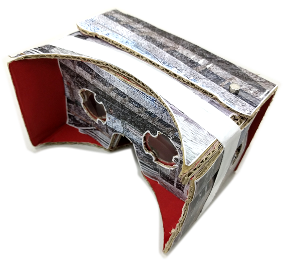
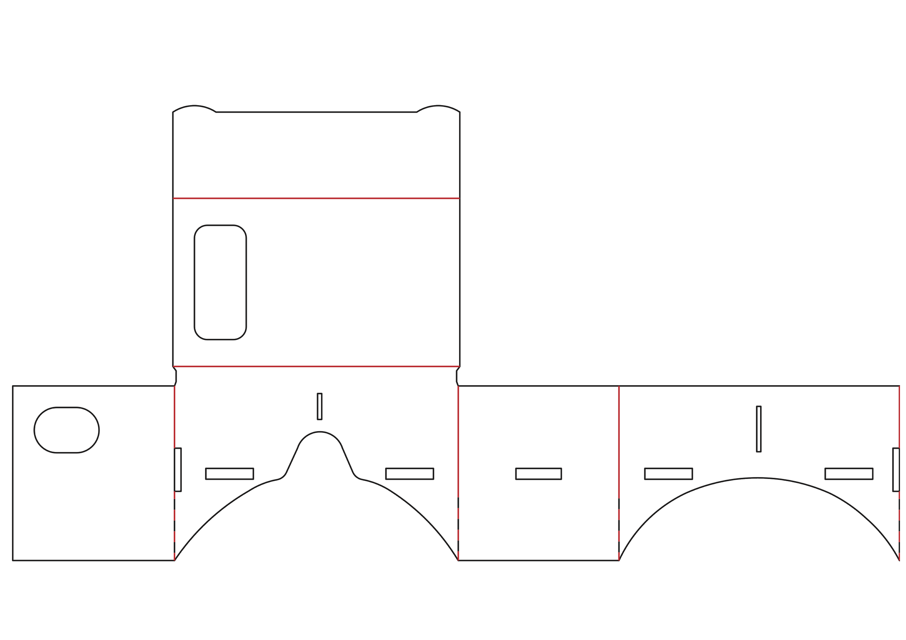
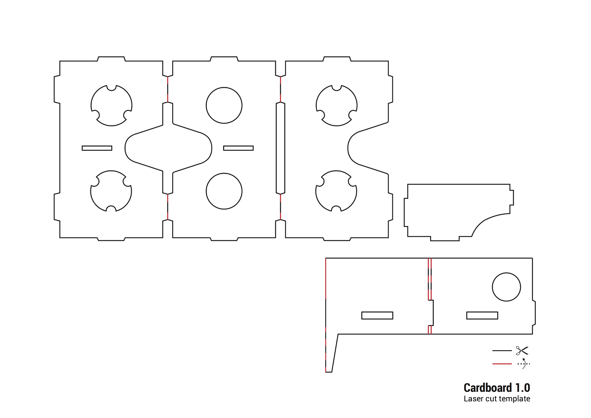
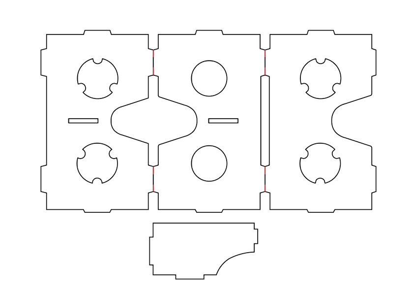
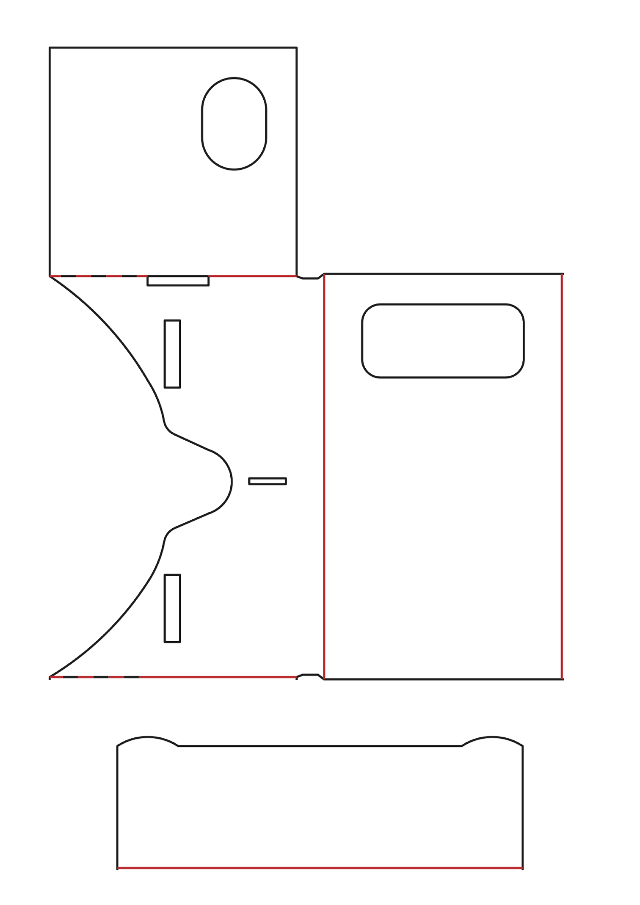

# vr-goggles-pattern

This repository contains A3/A4 paper-sized patterns for VR based on Google Cardboard 2014.

## How to use?

Print-out images in original size with A3/A4 paper. 

## How to make it?

This article (jp) is useful to make goggles.  
http://www.tokyo-indie-band.com/2015/07/360mv-cardboard.html

## Contents

* a3-basic
  * A3用紙でVRゴーグルを作るための雛型
    * 
    * 
* a3-motoko
  * VRゴーグルの作例
    * 
    * 
* a4-basic
  * A4用紙でVRゴーグルを作るための雛型
    * 
    * 